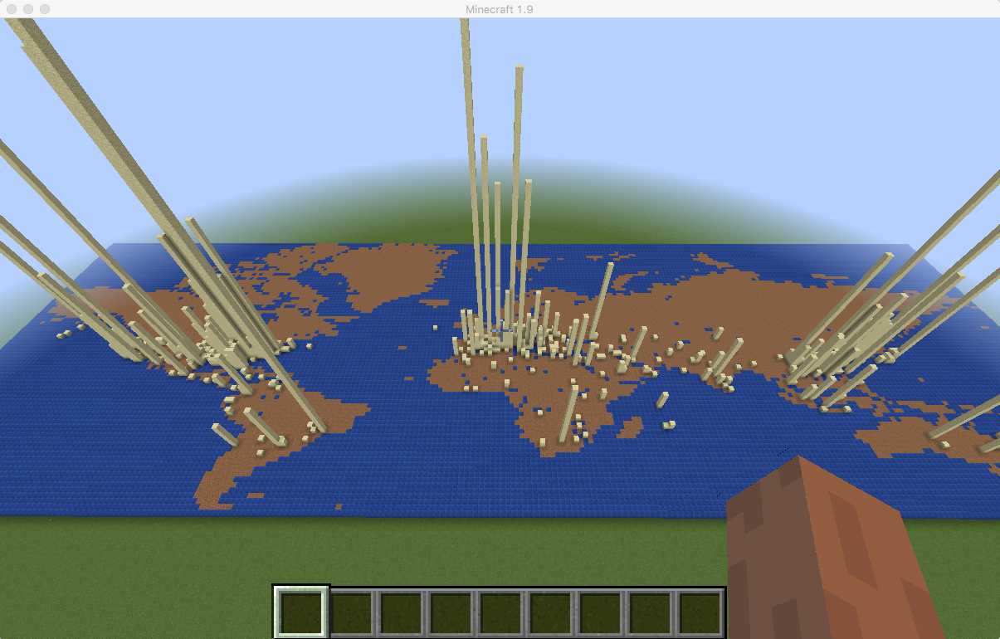

Visualizing Apache Log Data... with StreamSets & Minecraft! 
===========================================================

[StreamSets Data Collector](https://streamsets.com/product/) (SDC) is an open source framework for building continuous big data pipelines. SDC can ingest data from origins such as Apache Web Server log files, outputting to destinations such as [Apache Kafka](http://kafka.apache.org/). This project is a Minecraft/Spigot plugin that consumes log data from a Kafka queue and renders it as sand blocks falling onto a map.

Click below to see the plugin in action:

NEW: I presented this demo at Hadoop Summit Dublin in April 2016:

Pre-requisites
--------------

* [StreamSets Data Collector](https://streamsets.com/product/)

* [Apache Kafka](http://kafka.apache.org/)

* [Minecraft](https://minecraft.net/)

* [Spigot](https://www.spigotmc.org/) server mod framework; the plugin will likely also work with [Bukkit](https://bukkit.org/)

* [Simple Logging Facade for Java](http://www.slf4j.org/) (SLF4J) - Kafka uses SLF4J for logging

Log Record Schema
-----------------

Records must be written to Kafka in JSON format; the following properties are used. All are optional, and any other properties are ignored:

    {
        "verb": "GET"
        "request": "/search/tag/list",
        "clientip": "65.91.212.94",
        "lat": 38.0,
        "lon": -97.0,
        "area": 1234.56
    }

You can use upper or lower case for property names.

* If `lat` and `lon` are both present, and within the map bounds (see below), a block will be rendered at height 100 over that location on the map. Note - you must use sand or gravel to get the falling effect.
* If `area` is present and 10000 or more, then the block will be sand, otherwise it will be gravel.
* If `verb` is present, then "`{verb}` `{request}` from `{clientip}`" will be sent to the Minecraft client UI as a broadcast message - e.g. `GET /index.html FROM 134.23.34.56`

Setup
-----

### StreamSets Configuration

Follow the [Log Shipping to Elasticsearch](https://github.com/streamsets/tutorials/blob/master/tutorial-1/readme.md) tutorial, with the following exceptions:

* Rather than Directory, configure a **File Tail** origin, with the following settings:

  | Files Property | Value |
  | --- | --- |
  | Data Format | **Log** |
  | File to Tail | Path: `/some/directory/access.log` - this can be a real Apache Log file, or you can use sample data (see below) |
  | | Naming: **Active File with Reverse Counter Files** |

  | Log Property | Value |
  | --- | --- |
  | Log Format | **Combined Log Format** |

* After setting up the Geo IP processor - do not add the Elasticsearch destination. Instead, add a **Kafka Producer** destination, configuring it to publish JSON to the `log` topic. Use the default **Multiple JSON Objects** option.

### Minecraft/Spigot Setup

[Download Minecraft](https://minecraft.net/download), then follow the [Spigot BuildTools instructions](https://www.spigotmc.org/wiki/buildtools/) to build and run the Spigot server.

### KafkaPlugin Setup

* [Download the KafkaPlugin JAR](https://github.com/metadaddy/KafkaPlugin/blob/master/dist/KafkaCraft.jar?raw=true) and place it in the Spigot plugins directory.

* [Download the SLF4J JAR](http://www.slf4j.org/download.html) and put it somewhere convenient. Do NOT put it in the Spigot plugins directory, as doing so will confuse Spigot.

* Copy the Kafka Client JAR (included with the Kafka distribution) to a convenient directory, again, NOT the Spigot plugins directory.

* Edit the Spigot start script to include the SLF4J and Kafka Client JAR files. On Mac/Linux, it will look like this:

        #!/bin/sh
        cd "$( dirname "$0" )"
        java -Xms512M -Xmx1024M -classpath /somewhere/convenient/slf4j-api-1.7.19.jar:\
        /somewhere/convenient/kafka-clients-0.9.0.0.jar:spigot-1.9.jar \
        org.bukkit.craftbukkit.Main

Start Spigot; you should see the Kafka plugin being enabled:

	[15:25:23 INFO]: [KafkaCraft] Enabling KafkaCraft v1.0
	[15:25:23 INFO]: [KafkaCraft] Enable
	[15:25:23 INFO]: [KafkaCraft] Read 80 lines of world map

Now start the Minecraft client, connect to the Spigot server (select **Multiplayer**, add a server at the appropriate address - `127.0.0.1` if you're running everything on the same machine), and type **/kafka**. You will be teleported into the sky and a world map will start to render in front of you. Rendering takes a minute or two; once the map is complete, the plugin will subscribe to the Kafka log topic and drop a sand block onto the map for each log record in the origin file.

If you want to 'play' sample data into the pipeline: in the KafkaPlugin directory use the readfile.sh script to send the sample access.log file line by line to the directory/file you specified in the File Tail origin. The script will pause for a random amount of time between 0s and 1s between each line.

	./readfile.sh access.log >> /some/directory/access.log

Map File Format
---------------

Two maps are included as text files - a map of the world and one of San Francisco. The format is ASCII art, with a JSON object as a one line header. The JSON object contains the coordinates of the top left and bottom right bounds of the map. Incoming lat/lon is scaled to a block location using these coordinates. Here's the first line of sf.txt as an example:

    {"topLeftLat":37.839351, "topLeftLon":-122.532321, "bottomRightLat":37.696869, "bottomRightLon":-122.317037}

Spaces in the ASCII art are rendered as water (lapis blocks), anything else is rendered as land (emerald blocks). You are, of course, free to tweak MapMaker.java to render characters as whatever you like!

I used http://www.ascii-art-generator.org/ to convert map images to ASCII art.

Have Fun!
---------

Any problems, feel free to [file an issue](https://github.com/metadaddy/KafkaPlugin/issues).
